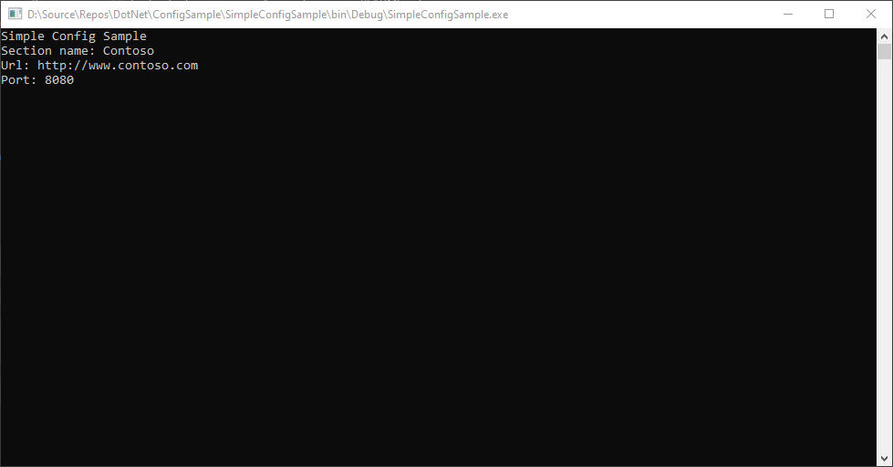

# ConfigSample

Project to demonstrate using a class to represent a configuration section

## SimpleConfigSample

### Setup

1. Create console project
2. Add reference to System.Configuration
3. Add App.config with the following content:

	```xml
	<?xml version="1.0" encoding="utf-8" ?>
	<configuration>
		<configSections>
			<section name="CustomSection" type="ConfigDomain.CustomSection, ConfigDomain" />
		</configSections>
		<CustomSection name="Contoso" url="http://www.contoso.com" port="8080" />
		<startup> 
			<supportedRuntime version="v4.0" sku=".NETFramework,Version=v4.8" />
		</startup>
	</configuration>
	```

4. Add class `CustomSection` representing the configuration section

    ```csharp
    using System;
    using System.Collections.Generic;
    using System.Linq;
    using System.Text;
    using System.Threading.Tasks;
    using System.Configuration;

    namespace ConfigDomain
    {
        public sealed class CustomSection : ConfigurationSection
        {
            public CustomSection() { }

            [ConfigurationProperty("name", DefaultValue = "Contoso", IsRequired = true, IsKey = true)]
            public string Name
            {
                get { return (string)this["name"]; }
                set { this["name"] = value; }
            }

            [ConfigurationProperty("url", DefaultValue = "http://www.contoso.com", IsRequired = true)]
            [RegexStringValidator(@"\w+:\/\/[\w.]+\S*")]
            public string Url
            {
                get { return (string)this["url"]; }
                set { this["url"] = value; }
            }

            [ConfigurationProperty("port", DefaultValue = (int)8080, IsRequired = false)]
            [IntegerValidator(MinValue = 0, MaxValue = 8080, ExcludeRange = false)]
            public int Port
            {
                get { return (int)this["port"]; }
                set { this["port"] = value; }
            }
        }
    }
    ```

5. Load configuration into variable

    ```csharp
    static void Main(string[] args)
    {
        Console.WriteLine("Simple Config Sample");

        var customSection = ConfigurationManager.GetSection("CustomSection") as CustomSection;

        Console.WriteLine($"Section name: {customSection.Name}");
        Console.WriteLine($"Url: {customSection.Url}");
        Console.WriteLine($"Port: {customSection.Port}");

        Console.Read();
    }
    ```

Sample Output



## References

- [Configuration Class](https://docs.microsoft.com/en-us/dotnet/api/system.configuration.configuration?view=dotnet-plat-ext-5.0)

## Additional Information

### Sealed

[sealed (C# Reference)](https://docs.microsoft.com/en-us/dotnet/csharp/language-reference/keywords/sealed)

> When applied to a class, the sealed modifier prevents other classes from inheriting from it. In the following example, class B inherits from class A, but no class can inherit from class B.

[When and why would you seal a class?](https://stackoverflow.com/questions/7777611/when-and-why-would-you-seal-a-class)

[Why Are So Many Of The Framework Classes Sealed?](https://docs.microsoft.com/en-us/archive/blogs/ericlippert/why-are-so-many-of-the-framework-classes-sealed)

> Good code does exactly what it was designed to do, no more, no less.
> 
> Let me expand upon that in four ways.
> 
> 1) Philosophical. OOP design includes subclassing to represent the polymorphic "is a" relationship between two things. A Giraffe IS AN Ungulate IS A Mammal IS AN Animal... Unless I can think of a clear case where a customer would need to express an IS A relationship with some code that I produce, I don't allow for such cases.
> 
> 2) Practical. Designing classes so that they can be effectively extended by third parties is HARD. (Look at the collection base classes for example.) You have to get the design right -- what is protected? You have to implement that design correctly. The test matrix grows enormously because you have to think about what weird things people are going to do. You have to document the protected methods and write documentation on how to properly subclass the thing.
> 
> This is all expensive and time consuming -- that is time that we could be spending looking for bugs in more important user scenarios, planning future versions, fixing security holes, whatever. There is only a finite amount of developer time we can spend on designing and implementing code, so we have to spend it the way that benefits customers most. If the class is not designed to be extended, I'm going to avoid all that expense by sealing it. I am not going to release half-baked classes that look extensible but in fact are not quite there.
> 
> 3) Compatible. If in the future I discover that I should have sealed a class, I'm stuck. Sealing a class is a breaking change. If I discover that I should have left a class unsealed, unsealing in a future version is a non-breaking change. Sealing classes helps maintain compatibility.
> 
> 4) Secure. the whole point of polymorphism is that you can pass around objects that look like Animals but are in fact Giraffes. There are potential security issues here.
